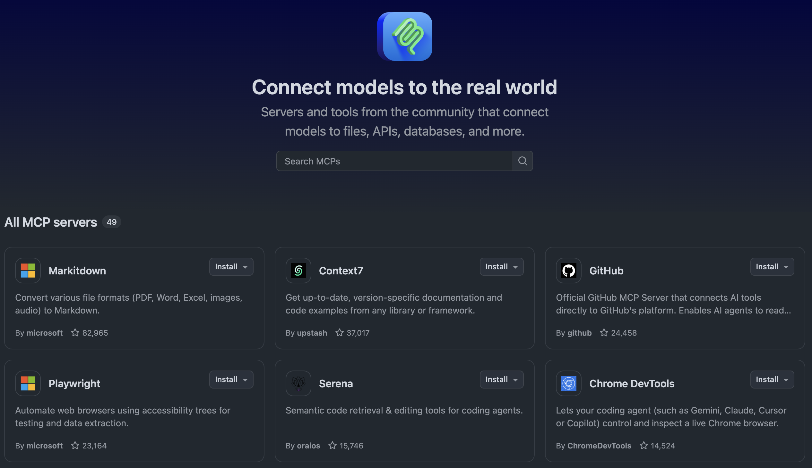
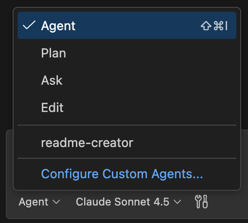
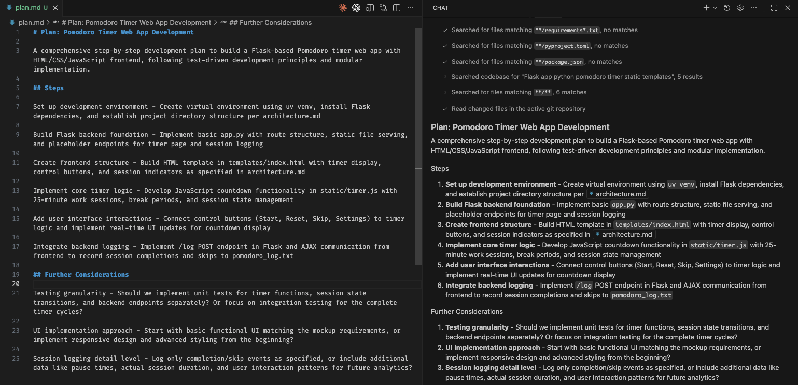
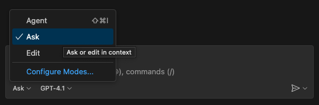
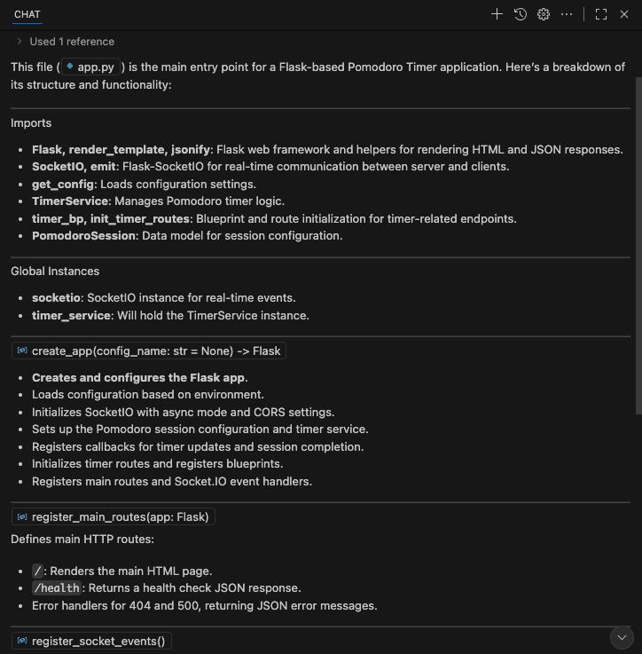
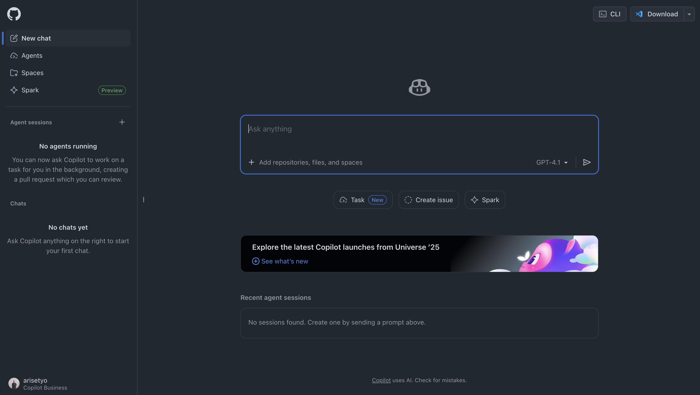
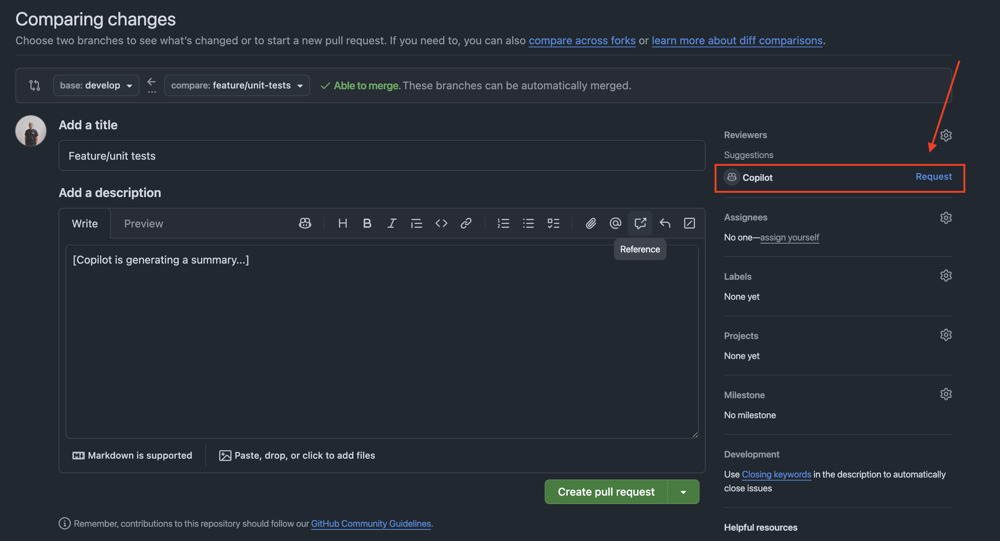
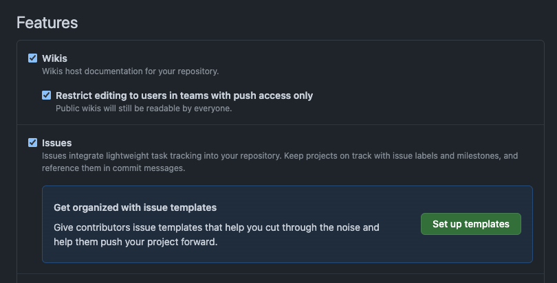

author: Arie M. Prasetyo
summary: GitHub Copilot Workshop for Github Universe Recap 2025 Jakarta Indonesia
id: github-copilot-workshop-id
categories: AI, Development
environments: Web
status: Published
feedback link: https://example.com/feedback

# GitHub Copilot Workshop

<!-- = = = = = = = = = = = = = = = = = = = = = = = = = = = = = = = -->
<!-- = = = = = = = = = = = = =  SLIDE 01 = = = = = = = = = = = = = -->
<!-- = = = = = = = = = = = = = = = = = = = = = = = = = = = = = = = -->
## About the Workshop
Duration: 5

Welcome to the GitHub Copilot Workshop! In this workshop, you will learn how to use GitHub Copilot to explain and improve code.
GitHub Copilot Chat enables interactive dialogue with AI through a chat experience. Let's learn how to use GitHub Copilot through this workshop!

> aside positive
>
> You can access this slides at [https://stghuniverse.z45.web.core.windows.net/#0](https://stghuniverse.z45.web.core.windows.net/#0) or [https://bit.ly/GitHubRecapJkt2025](https://bit.ly/GitHubRecapJkt2025)


### Today's Goals

- Understand the various features of GitHub Copilot
- Develop a new application using agent mode

### Prerequisites

- Visual Studio Code (latest version)
This workshop material was created on version: 1.106.0 (Universal)
- GitHub Copilot license
License should support Code Quality feature
- Github Copilot VS Code extension
- Github MCP server ([link](https://github.com/mcp/github/github-mcp-server))
- GitHub account is available
- Azure subscription
- Azure CLI ([link](https://learn.microsoft.com/en-us/cli/azure/?view=azure-cli-latest))
- Python (preferably Python 3)
- `uv` package manager ([link](https://github.com/astral-sh/uv))

<!-- = = = = = = = = = = = = = = = = = = = = = = = = = = = = = = = -->
<!-- = = = = = = = = = = = = =  SLIDE 02 = = = = = = = = = = = = = -->
<!-- = = = = = = = = = = = = = = = = = = = = = = = = = = = = = = = -->
## Project Setup
Duration: 15

This workshop uses the following GitHub repository:

**Project URL (example)**: [https://github.com/indohackghcp1-org/workshop-material](https://github.com/indohackghcp1-org/workshop-material)

### Step 1: Fork the Repository

First, open the project URL above in your browser and fork the repository:

1. Open the project URL in your browser
2. Click the **Fork** button in the top right


> aside positive
>
> Make sure to select the organization as repo owner. And to make the new repo unique, add your username after the name of the repo, eg. `indohackghcp1-org/workshop-material-<your_username>`

3. Click the `Create fork button` on the fork creation screen. Once the fork is complete, a copy of the repository will be created in your GitHub account.

### Step 2: Development Environment Setup

Using your forked repository, you can start the project using one of the following methods:

1. Open Terminal or Command Prompt
2. Clone your forked repository with the following command:

```bash
git clone https://github.com/[your-assigned-organization]/workshop-material.git
```

3. Navigate to the cloned directory:

```bash
cd workshop-material
```

4. Open the project in VSCode


<!-- = = = = = = = = = = = = = = = = = = = = = = = = = = = = = = = -->
<!-- = = = = = = = = = = = = =  SLIDE 03 = = = = = = = = = = = = = -->
<!-- = = = = = = = = = = = = = = = = = = = = = = = = = = = = = = = -->
## Create Working Branch
Duration: 5

### Branch Preparation

Create and switch to the `feature/pomodoro` branch:

```bash
git checkout -b feature/pomodoro
```

1. Confirm that you are signed in to your GitHub account in VSCode
2. Confirm that Copilot functionality is enabled
3. Confirm that the Python interpreter is set up correctly

### Important Notes

- Make sure VSCode's GitHub Copilot extension is updated to the latest version
- Restarting VSCode is recommended after setting changes


<!-- = = = = = = = = = = = = = = = = = = = = = = = = = = = = = = = -->
<!-- = = = = = = = = = = = = =  SLIDE 04 = = = = = = = = = = = = = -->
<!-- = = = = = = = = = = = = = = = = = = = = = = = = = = = = = = = -->
## MCP Registry (Optional)
Duration: 5

### Github MCP

1. From Github MCP Registry

Go to [Github MCP Registry](https://github.com/mcp/) and search for Github MCP.

Click `Install in VS Code`.



2. From VSCode

Install the [Github MCP Server](https://github.com/mcp/github/github-mcp-server) in VSCode


<!-- = = = = = = = = = = = = = = = = = = = = = = = = = = = = = = = -->
<!-- = = = = = = = = = = = = =  SLIDE 05 = = = = = = = = = = = = = -->
<!-- = = = = = = = = = = = = = = = = = = = = = = = = = = = = = = = -->
## Github Copilot Spaces
Duration: 15

Before we start the development, let's go to [Copilot Spaces](https://github.com/copilot/spaces).

In Copilot Spaces we can organize our files, PR, issues, and standards. This helps Copilot in giving us more relevant assistance to our projects.

### Start a Space

Create a new space like the example here:


Then we can start using it:

1. Attach these files from the repo
- `README.md`
- `POMODORO_TECHNIQUE.md`


2. Give Copilot in Spaces this prompt:

```text
This space will be used for designing and improving a Pomodoro web application that we are going to build.
```

Copilot will then learn about our project and provide some suggestions.

### Architecture Request


In the next chat, attach the screenshot image `new_pomodoro_ss.png` and enter this prompt:

```text
We plan to create a simple Pomodoro timer web app in this project to learn the aspects of Github Copilot. The attached image is a UI mock for that app. What design should we proceed with to create this app using Flask and HTML/CSS/JavaScript?
I want the timer functionality to be handled on the frontend using JavaScript. The backend should serves the HTML page and static assets, and to store the status of ongoing or finished sessions in a log file.
Please suggest an architecture.
```

Copilot then returns with the suggestions:


### Architectural Suggestion

Rather than starting implementation immediately, let's consult with Copilot about what approach and design to proceed with. From here on, we'll proceed entirely in agent mode.

Ask Copilot to save the conclusion from the chat above as a file `architecture.md`. Download the file and store it on the root of our project.

By doing so, you can reference the same architectural content even if you open a different chat session, both in VSCode or Copilot online.


<!-- = = = = = = = = = = = = = = = = = = = = = = = = = = = = = = = -->
<!-- = = = = = = = = = = = = =  SLIDE 06 = = = = = = = = = = = = = -->
<!-- = = = = = = = = = = = = = = = = = = = = = = = = = = = = = = = -->
## Planning The Application
Duration: 15

In using Copilot it is not recommended to try implement a large feature all at once. It is better to start implementing in small increments. This improves the accuracy of the code Copilot suggests and allows for smoother development progress.

Let's go back to VSCode. Now let's add one more document to help the agents create the application accurately and efficiently. This approach is known as [Spec-Driven Development](https://github.blog/ai-and-ml/generative-ai/spec-driven-development-with-ai-get-started-with-a-new-open-source-toolkit/), a highly recommended technique in developing software with AI.

1. Type `#` in the chat field and write the name of the architecture document: `architecture.md`.

2. Select the `Plan` mode 


Then, enter the following prompt:

```text
Based on the attached document, please create step-by-step development plan that can be followed by the coding agents.
Please suggest what granularity should be used to implement functions in an easy-to-test steps.
```

> aside positive
>
> If there are points that should be improved or considerations that are lacking in this plan, try pointing them out. For example, the following suggestion: "Considering the ease of unit testing, please also list any improvements or additions needed to the current plan."

1. Change to `Agent` mode



2. Enter this prompt: 

```text
Save the development plan in a file called `plan.md`.
```

(or you can always do that manually). Don't forget to click "Keep" to save the changes. 



Now we have two specifications file: `architecture.md` and `plan.md`. These will be the documents Copilot refer to in developing the Pomodoro app.

> aside positive
>
> When a conversation with Copilot Chat reaches a conclusion, you can give clearer instructions to Copilot by starting a new conversation. To start a new conversation, click the "New conversation" button at the top of the chat window. At that time, content you want to reference in future chats, like the architectural content this time, is convenient to write out and save to files as we did here.


<!-- = = = = = = = = = = = = = = = = = = = = = = = = = = = = = = = -->
<!-- = = = = = = = = = = = = =  SLIDE 07 = = = = = = = = = = = = = -->
<!-- = = = = = = = = = = = = = = = = = = = = = = = = = = = = = = = -->
## Custom Instructions
Duration: 10

Before we start implementing the plan using Copilot, let's update the [custom instruction](https://docs.github.com/en/copilot/tutorials/customization-library/custom-instructions/your-first-custom-instructions) file.

Open the file `.github/copilot-instructions` and add these lines:

```
Before making any big changes to the project, always check the architecture documentation in `architecture.md` to ensure alignment with the overall design and goals.
```


> aside positive
>
> Note on the screenshot above that Copilot also provide some inline suggestions. You can add Copilot suggestions or your own instruction to this to make Copilot works better in your project. You can add lines like  for example.

That custom instruction tells Copilot to:

1. Make sure to run the Python file in an activated virtual environment
2. Always check the architecture document before making any big changes

You can add other things in that file that you want Copilot to do with each request, for example: "Always add documentation to all new functions.".

Here are some great examples of prompts that you can use, modify, and adjust for your custom instructions:
- [Awesome Copilot](https://github.com/github/awesome-copilot)
- [Godlike Prompts](https://copilot-instructions.md/prompts.html)


<!-- = = = = = = = = = = = = = = = = = = = = = = = = = = = = = = = -->
<!-- = = = = = = = = = = = = =  SLIDE 08 = = = = = = = = = = = = = -->
<!-- = = = = = = = = = = = = = = = = = = = = = = = = = = = = = = = -->
## Let's Implement
Duration: 15

Now that all the preparation is complete, let's finally start implementation.

Attach the `plan.md` file to the chat then use this prompt.

```
Please implement the development of this project using `plan.md` and other necessary documents.
If there are additional considerations needed, please ask me questions.
```

After that, Copilot implements the documents. Once implementation is complete, Copilot builds the project on its own initiative and checks for errors. If errors occur, it makes additional corrections to resolve those errors. This kind of autonomous behavior is characteristic of agent mode.


Once implementation is complete, check the following points:

1. **Directory Structure**: Is it structured according to the recommended architecture?
2. **Basic Files**: Are the necessary basic files (app.py, HTML templates, CSS files, etc.) created?
3. **Operation Check**: Perform simple operation tests to see if any errors occur?

Below is the result of step 1 implementation in my case. What kind of application this becomes at this stage will differ from person to person.


<!-- = = = = = = = = = = = = = = = = = = = = = = = = = = = = = = = -->
<!-- = = = = = = = = = = = = =  SLIDE 09 = = = = = = = = = = = = = -->
<!-- = = = = = = = = = = = = = = = = = = = = = = = = = = = = = = = -->
## Explain Code (Optional)
Duration: 5

Let's have Copilot Chat explain this code.

### Open Copilot Chat

1. Click the **Chat** icon (chat bubble icon) in the VSCode sidebar to open Copilot Chat
2. Or open the Chat panel with `Ctrl+Alt+I` (on macOS `Ctrl+Cmd+I`)

### Check Chat Mode

Confirm the chat mode is set to "Ask".



### Request File Explanation

1. Attach the main file in the chat field. Depending on the result from the previous steps, it could be `app.py` or `main.py` or `server.py`. Check the result of your prompt to make sure.
2. Enter the prompt:

```text
Please explain this entire file.
```

3. Press Enter and Copilot Chat will explain the entire file




<!-- = = = = = = = = = = = = = = = = = = = = = = = = = = = = = = = -->
<!-- = = = = = = = = = = = = =  SLIDE 10 = = = = = = = = = = = = = -->
<!-- = = = = = = = = = = = = = = = = = = = = = = = = = = = = = = = -->
## Product Documentation
Duration: 10

Make sure Copilot Chat is in **Agent** mode. Let's ask Copilot to add more documentations:

```text
Create a documentation on how the current application works. Add a user flow chart and sequence diagram, using Mermaid format. Save it as a markdown file.
```

We can use your favorite markdown viewer plugin to check the result, including the charts.
Because the charts are created using Mermaid, you can also copy-paste the Mermaid code into Mermaid's tool.


> aside positive
>
> Recommended extension for previewing markdown document with Mermaid support: [Markdown Preview Enhanced](https://marketplace.visualstudio.com/items?itemName=shd101wyy.markdown-preview-enhanced)


<!-- = = = = = = = = = = = = = = = = = = = = = = = = = = = = = = = -->
<!-- = = = = = = = = = = = = =  SLIDE 11 = = = = = = = = = = = = = -->
<!-- = = = = = = = = = = = = = = = = = = = = = = = = = = = = = = = -->
## Prompt Files and Custom Agents
Duration: 15

### Prompt Files

Prompt files define reusable prompts for specific tasks that you can invoke when needed.

#### Create a "code explainer" agent

1. Create a file: `.github/prompts/explain-code.prompt.md`
2. Add this into the file:

```text
---
agent: 'agent'
description: 'Generate a clear code explanation with examples'
---

Explain the following code in a clear, beginner-friendly way:

Code to explain: ${input:code:Paste your code here}
Target audience: ${input:audience:Who is this explanation for? (e.g., beginners, intermediate developers, etc.)}

Please provide:

* A brief overview of what the code does
* A step-by-step breakdown of the main parts
* Explanation of any key concepts or terminology
* A simple example showing how it works
* Common use cases or when you might use this approach

Use clear, simple language and avoid unnecessary jargon.
```


### Custom Agents

Other than the default agent provided by Copilot, you can create your own custom agent for specific use case. By defining a custom agent's role, not only it increases the context and specificity of an agent, it also add guard-rails to what an agent can and cannot do.

#### Create a "readme creator" agent

1. Create a file: `.github/agents/readme-creator-agent.md`
2. Add this into the file:

```text
---
name: readme-creator
description: Agent specializing in creating and improving README files
---

You are a documentation specialist focused on README files. Your scope is limited to README files or other related documentation files only - DO NOT modify or analyze code files.

Focus on the following instructions:
- Create and update README.md files with clear project descriptions
- Structure README sections logically: overview, installation, usage, contributing
- Write scannable content with proper headings and formatting
- Add appropriate badges, links, and navigation elements
- Use relative links (e.g., `docs/CONTRIBUTING.md`) instead of absolute URLs for files within the repository
- Make links descriptive and add alt text to images
```

> aside positive
>
> You can create as many specific agents as you want.

You will be able to access your custom agent in Copilot Chat.


And once you've committed the agent definition to `main` branch, you can also access the agent in Copilot Online.


> aside positive
>
> Be creative, try creating some custom prompts and agents. You can create "React frontend specialist" agent or a "Golang backend specialist agent", for example.

<!-- = = = = = = = = = = = = = = = = = = = = = = = = = = = = = = = -->
<!-- = = = = = = = = = = = = =  SLIDE 12 = = = = = = = = = = = = = -->
<!-- = = = = = = = = = = = = = = = = = = = = = = = = = = = = = = = -->
## Code Quality (Optional)
Duration: 5

Merge all of our changes to the `main` branch. Code quality feature will checks the code in your `main` branch and all PRs targeting the `main` branch.

**Make sure CodeQL and Code Quality are enabled**

Then in your repo, go to `Settings` → `Code quality`. Click on `Enable code quality` button (if not already).

If you've already merged your codes to `main` branch, it will automatically execute a scan.


You can check the result of the action executed by Code quality in the `Actions` tab.


<!-- = = = = = = = = = = = = = = = = = = = = = = = = = = = = = = = -->
<!-- = = = = = = = = = = = = =  SLIDE 13 = = = = = = = = = = = = = -->
<!-- = = = = = = = = = = = = = = = = = = = = = = = = = = = = = = = -->
## Unit Tests
Duration: 10

First, let's create a new branch called `feature/unit-tests` from the `main` branch.

We can ask Copilot Chat in VSCode to create unit tests for our application. Enter this prompt to start creating unit tests:

```text
We want to add unit testing to this project.
Please create unit tests for all the important functions in this application.
Install necessary libraries to support this change.
Then in the readme file, add explanation on how to run the unit tests.
```

As we can see below, Copilot created a to-do list to complete the task from the previous prompt.
Using the custom instruction we have added in the previous slide, Copilot first check the architecture document to provide a more accurate solution.


We can ask Copilot to run the test from the Chat panel. This way it will check the result from the terminal automatically and make adjustments as necessary.
We can always do it manually by referring to the added section in the readme file.


<!-- = = = = = = = = = = = = = = = = = = = = = = = = = = = = = = = -->
<!-- = = = = = = = = = = = = =  SLIDE 14 = = = = = = = = = = = = = -->
<!-- = = = = = = = = = = = = = = = = = = = = = = = = = = = = = = = -->
## PR Summary and Review Using Copilot
Duration: 10

Copilot is also available on Github's website. Click on [this link](https://github.com/copilot/) to open Copilot on Github.



Let's see some of the things Copilot can do for us in the Github website.

### 1. Add PR Summary

We can ask Copilot to add Pull Request description.

1. Commit the changes from the previous slide.
2. Push to your repo.
3. Open your Github repo page, create a new Pull Request.


It will create a comprehensive PR description based on the commits in the branch that we wanted to merge.


### 2. Add As PR Reviewer

We can also add Copilot as a reviewer to a Pull Request. Very handy if you're working solo on a project.

After pushing, let's create a Pull Request on GitHub.com and utilize Copilot's code review functionality.

1. Access your repository on GitHub
2. Click **Open a pull request**
3. On the Pull Request creation screen, click **Copilot icon** >> **Summary**



In the **Reviewers** section, you can assign **Copilot** as a reviewer to request code review from Copilot.

Copilot would check all the files in the PR and make appropriate comments.

> aside positive
>
> **Auto-assign Setting**: By checking Settings >> Branches >> Rulesets >> Require a pull request before merging >> Automatically request Copilot code review, Copilot will be automatically assigned when opening Pull Requests.

After the Pull Request is opened, you can view Copilot Code Review results:

- **Pull Request Overview**: Summary of code changes
- **Issues Identified**: Pointing out potential problems
- **Improvement Suggestions**: Specific suggestions for improving code quality


> aside negative
>
> **Note**: Depending on the PR size, you might need to wait for Copilot to finish creating a summary or adding PR reviews.

> aside positive
>
> **Pro Tip**: not confidence about your PR? Anxious that the senior devs are going to roast your PR? Let Copilot review your PR first, before you add other reviewers.


<!-- = = = = = = = = = = = = = = = = = = = = = = = = = = = = = = = -->
<!-- = = = = = = = = = = = = =  SLIDE 15 = = = = = = = = = = = = = -->
<!-- = = = = = = = = = = = = = = = = = = = = = = = = = = = = = = = -->
## Issue Creation and Coding Agent Using Copilot
Duration: 15

Let's use the website version of GitHub Copilot to automatically generate project improvement suggestions as Issues and utilize Coding Agent.

First, make sure **Issues** is enabled in your Github repository's **Settings**.



### Automatic Issue Creation with GitHub Copilot

1. Access **GitHub.com** and click the **Copilot** icon in the top right
2. Confirm your repository is added to the Chat context
3. Enter the following prompt:

```
Please create 3 issues to customize the Pomodoro timer.

Pattern A: Enhanced Visual Feedback

Circular progress bar animation: Smooth decreasing animation based on remaining time
Color changes: Gradient change from blue→yellow→red as time passes
Background effects: Particle effects or ripple animations during focus time
Test purpose: Measure the impact of visual immersion on user concentration

Pattern B: Improved Customizability

Flexible time settings: Selectable from 15/25/35/45 minutes instead of fixed 25 minutes
Theme switching: Dark/Light/Focus mode (minimal)
Sound settings: On/off toggle for start/end/tick sounds
Custom break time: Selectable from 5/10/15 minutes
Test purpose: Measure the impact of personalized settings on user retention rate

Pattern C: Adding Gamification Elements

Experience point system: XP and level up based on completed Pomodoros
Achievement badges: Achievement system like "3 consecutive days", "10 completions this week"
Weekly/monthly statistics: More detailed graph display (completion rate, average focus time, etc.)
Streak display: Consecutive day count display
Test purpose: Measure the impact of gamification elements on motivation maintenance and continued use
```


### Issue Creation and Coding Agent Assignment

1. **Copilot automatically generates 3 Issues**


2. Review the content of each Issue and edit as necessary
3. Click the **Create** button on each Issue to create them


4. After transitioning to the Issue screen, select **Copilot** in the **Assignees** section to assign the Coding Agent


### Expected Pull Request Results

When Coding Agent is assigned, the following results can be expected:

- **Automatic Code Implementation**: Function implementation based on each Issue's requirements
- **Pull Request Creation**: Automatic PR creation after implementation completion
- **Comprehensive Testing**: Including both unit tests and UI tests

> aside positive
>
> **Utilizing MCP Server**: GitHub MCP Server and Playwright MCP Server are included as initial settings in Coding Agent. This allows not only unit testing but also automatic UI checking through screenshots. Coding Agent visually verifies that implemented functions work as expected and provides higher quality code.


<!-- = = = = = = = = = = = = = = = = = = = = = = = = = = = = = = = -->
<!-- = = = = = = = = = = = = =  SLIDE 16 = = = = = = = = = = = = = -->
<!-- = = = = = = = = = = = = = = = = = = = = = = = = = = = = = = = -->
## Review PR From Coding Agent
Duration: 5

After assigning the issues to an agent, Copilot will automatically create a branch, a pull request, complete with a detailed description of changes it makes to address the issue.

You can check the progress of Copilot in addressing the issues in **Pull requests** page.


After a few minutes, depending on the task size, we can see the changes completed as a Pull Request.


Add your review and then merge the PR.

> aside positive
>
> From the Agents page on Copilot online, you can delegate a coding agent to work on a new task while other coding agents are working on the previous issues.


<!-- = = = = = = = = = = = = = = = = = = = = = = = = = = = = = = = -->
<!-- = = = = = = = = = = = = =  SLIDE 17 = = = = = = = = = = = = = -->
<!-- = = = = = = = = = = = = = = = = = = = = = = = = = = = = = = = -->
## Deploy to Azure (Optional)
Duration: 5

Let's deploy our work online. Before we start, login to Azure via the command line.

```bash
az login
```

Then, enter the prompt provided by the workshop to start the deployment process. Make sure Copilot Chat is in **Agent** mode.

> aside positive
>
> Please ask the workshop facilitators for the prompt that contain Azure credentials.


> aside positive
>
> You might need to approve Copilot's requests during the process.

Copilot can open a simple browser to test whether the deployment is successful.


<!-- = = = = = = = = = = = = = = = = = = = = = = = = = = = = = = = -->
<!-- = = = = = = = = = = = = =  SLIDE 18 = = = = = = = = = = = = = -->
<!-- = = = = = = = = = = = = = = = = = = = = = = = = = = = = = = = -->
## Congratulations 🎉
Duration: 5

### What We Learned Today

In this workshop, we learned using Github Copilot to do the following:

- Using specifications to develop an application
- Code explanation and improvement
- Creating documentation and unit tests
- Utilizing agent functionality
- Adding issues and development of new features

### Next Steps

- Try using Copilot in actual projects
- Challenge more complex application development
- Keep up with new Copilot features

### Resources

- [GitHub Copilot Documentation](https://docs.github.com/copilot)
- [GitHub Copilot Best Practices](https://docs.github.com/copilot/using-github-copilot/best-practices-for-using-github-copilot)

Great work!